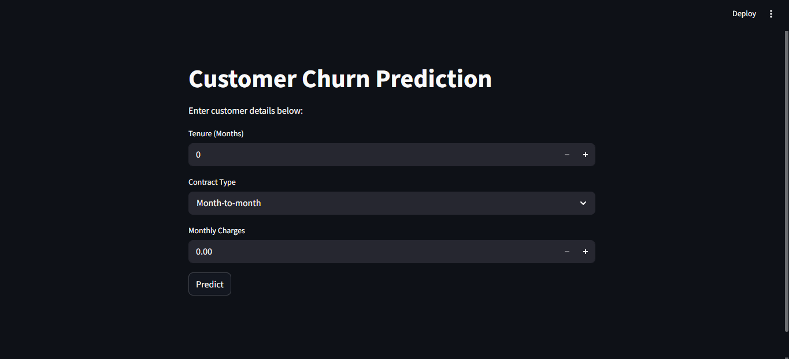
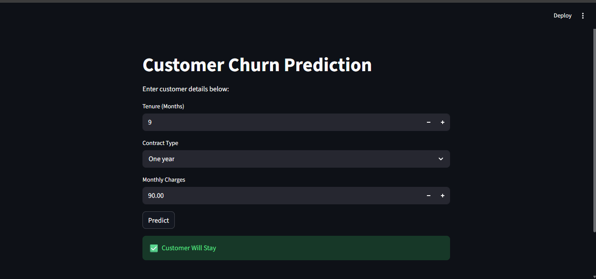
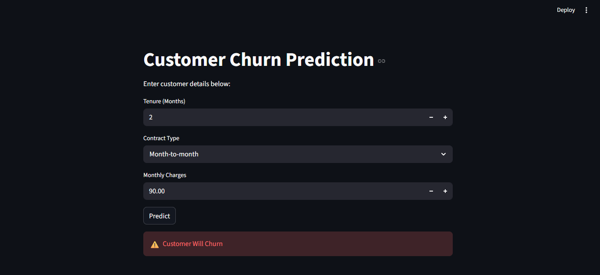

# Customer Churn Prediction System

This project predicts whether a telecom customer is likely to leave the company or stay using Machine Learning techniques.

The project includes data preprocessing, EDA, model training using Random Forest, and an interactive web application built with Streamlit for real time predictions.

## Technologies Used
- Python
- Pandas
- Scikit-learn
- Streamlit
- Matplotlib
- Seaborn

# Project Logic

The model predicts customer churn based on factors like contract type, monthly charges, tenure, and total charges.

Customers with:
- shorter tenure,
- higher monthly charges,
- and month-to-month contracts

are more likely to churn.

Customers with:
- long-term contracts,
- longer tenure,
- and stable payment history

are more likely to stay with the company.

The Streamlit application allows users to enter customer details and instantly check the churn prediction.

# How It Works

1. The dataset is loaded and cleaned using Pandas.
2. Categorical values are converted into numerical format using Label Encoding.
3. The data is split into training and testing sets.
4. A Random Forest Classifier is trained on the dataset.
5. The trained model is saved using Joblib.
6. A Streamlit web application takes user input and predicts whether the customer will churn or stay.

# Model Workflow

Dataset → Data Cleaning → Encoding → Model Training → Prediction → Streamlit Interface

# Application Screenshot

# Prediction Result

